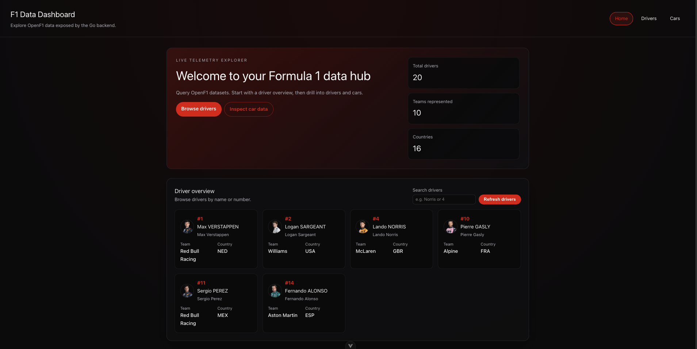
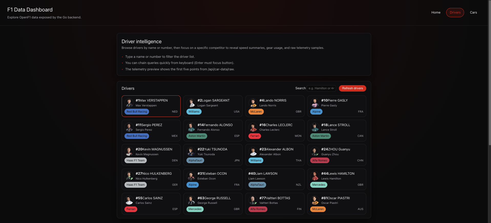
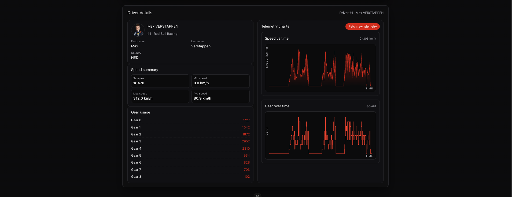
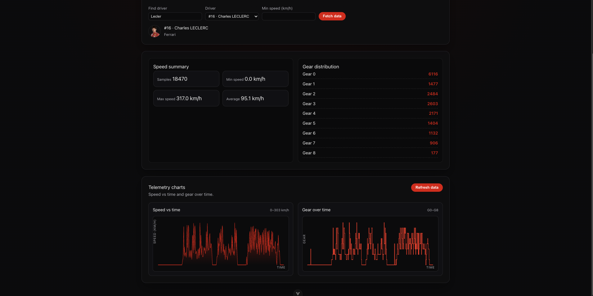

# F1 Data Dashboard

F1 Data Dashboard is a Vue 3 + Vite frontend for exploring Formula 1 telemetry exposed by the Go backend in this repository. The backend proxies data from the [OpenF1 API](https://openf1.org/) and exposes local endpoints for drivers, sessions, raw car data, speed summaries, and gear usage.

The app focuses on a default OpenF1 session and lets you browse drivers, inspect individual driver telemetry, and compare speed and gear behavior through lightweight charts.

## What it shows

- Home dashboard with driver, team, and country summary cards.
- Driver overview with searchable driver cards, team labels, country codes, and headshots when available.
- Driver details with speed summary metrics, gear usage counts, and speed/gear telemetry charts.
- Cars telemetry explorer with driver search, minimum speed filtering, raw telemetry fetches, and charts for speed and gear over time.

## Screenshots

### Home dashboard



### Driver overview



### Driver details



### Cars telemetry



## Tech stack

- Vue 3
- Vite
- Vue Router
- Axios
- Go backend using the standard `net/http` package
- OpenF1 API as the upstream Formula 1 data source

## Requirements

- Node.js `^20.19.0` or `>=22.12.0`
- npm
- Go `1.21.3` or newer
- Internet access for the backend to reach `https://api.openf1.org/v1`

## Setup

Run the backend first. From this `frontend` directory:

```sh
cd ../backend
go run .
```

The backend listens on:

```txt
http://localhost:8080
```

In another terminal, install and run the frontend:

```sh
cd ../frontend
npm install
npm run dev
```

The Vite dev server usually runs on:

```txt
http://localhost:5173
```

## Configuration

The frontend reads these optional environment variables:

```sh
VITE_API_BASE_URL=http://localhost:8080
VITE_DEFAULT_SESSION_KEY=9159
```

If no values are provided, the app uses `http://localhost:8080` for the API and `9159` as the default OpenF1 session key.

Create a local `.env` file in the `frontend` directory if you want to override them:

```sh
VITE_API_BASE_URL=http://localhost:8080
VITE_DEFAULT_SESSION_KEY=9159
```

## Available scripts

```sh
npm run dev
```

Starts the frontend development server with hot reload.

```sh
npm run build
```

Builds the production bundle into `dist/`.

```sh
npm run preview
```

Serves the production build locally.

```sh
npm run format
```

Formats files under `src/` with Prettier.

## Backend endpoints used by the frontend

- `GET /api/drivers`
- `GET /api/drivers/speed-summary`
- `GET /api/car-data/raw`
- `GET /api/car-data/gear-usage`
- `GET /api/meetings`
- `GET /api/sessions`
- `GET /api/session-results`

Most telemetry requests use `session_key`, `driver_number`, and optional `min_speed` query parameters.

## Notes

- The backend CORS configuration allows the Vite dev origin `http://localhost:5173`.
- Data availability depends on OpenF1. Some drivers or sessions may not include every telemetry field.
- The default session key can be changed without code changes by setting `VITE_DEFAULT_SESSION_KEY`.
